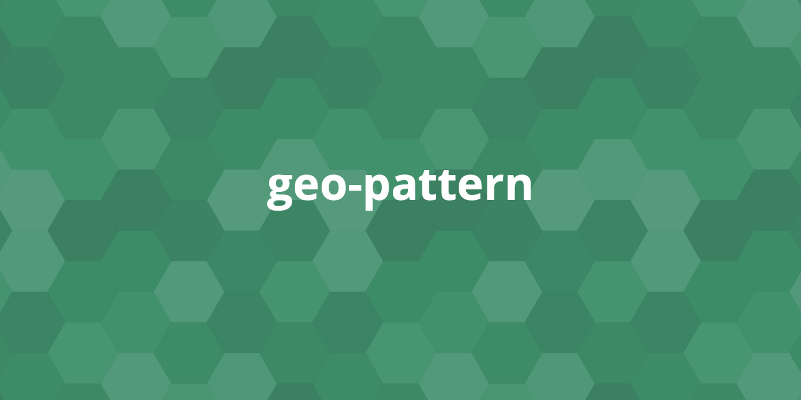
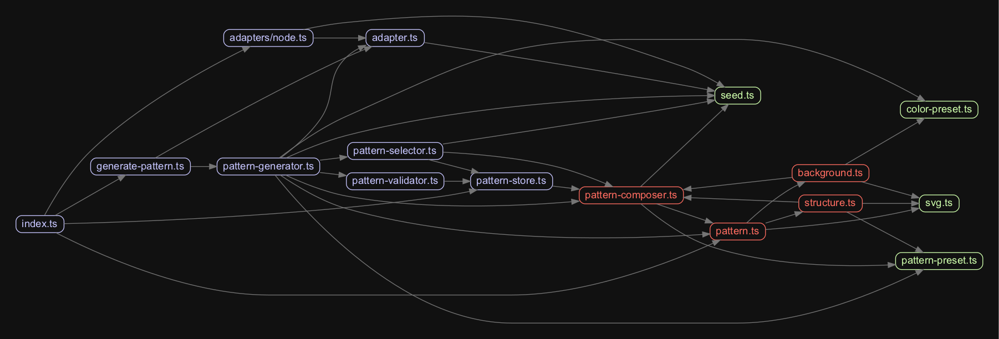
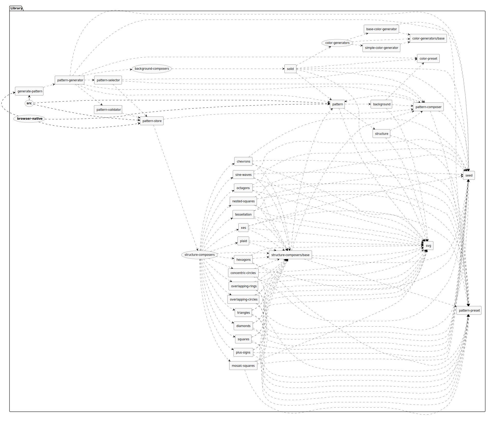

# geo-pattern

[](https://github.com/mooyoul/geo-pattern/actions)
[](https://github.com/mooyoul/geo-pattern/actions)
[](https://github.com/semantic-release/semantic-release)

[](https://renovatebot.com/)
[](http://mooyoul.mit-license.org/)




Create beautiful generative geometric background images from a string ✨

## Live Demo

https://mooyoul.github.io/geo-pattern/

### E2E Test Status

Browser | Status | Build
------- | ------ | -----
IE 11 | [](https://automate.browserstack.com/public-build/bHdTZXlVcUlOUDNYREFHT2VXQVNNSkUyem13UmlRSjluMUxKVDhBcEp6Yz0tLVhsQ2lGWDlqZmhSR3RSakRTSmZhM3c9PQ==--b360da4849c28dff92635b2514e764b9b4e91230) | ES5 Build
Edge Latest | [](https://automate.browserstack.com/public-build/aU1ZdUFFd004Y0liQmFqWTk0cGtzR20rWmhxZ1M0WlRmdVZONWMvdTZ5ST0tLUNTMzVZQ1VHNm93L2dmL0JYcWl0c2c9PQ==--e434d87aa6b1701535bd03715d993e3047c748ce) | ES6 Build
Firefox Latest | [](https://automate.browserstack.com/public-build/YUpMNzJJTHdDRHNuOUFHYmh1WXVwOTAyOHNkVXJ4VUl0ZUg2SzdsSXZPaz0tLWdSL1oxQ3JlMFdjQWtRUjh3UGZOVVE9PQ==--1e8c4336b8b07cc1a2d062e1b6d8bca5190caeb8) | ES6 Build
Edge 15 | [](https://automate.browserstack.com/public-build/Zjd6RlhDN3MvWEtnRHdMVmZhVWdFZU9tU0JHb1p2a20rU2JVNWt3b2g0RT0tLWRrMzlpWCs5L0M3S00yMVk3NkJKdkE9PQ==--388c162d3eee3a5bed67a6d2bf66e663cd0734ed) | ES6 Build
Chrome Latest | [](https://automate.browserstack.com/public-build/WThJU2JMK0NSZDRtNWp1bncvWGpPdHR6V2QzYk82R21kdHNDT3NsMGNiYz0tLUZxdnByN0NPbHJERml4Y1hBb0EzN3c9PQ==--fedf40b9edcf4cb7747c36c13593efa0352ef254) | ES6 Build, Native Build
macOS Safari Latest | [](https://automate.browserstack.com/public-build/VjQrYWZEQlNPcVlHYXlwRzhLWkUzNkVyK2gyWU9KRHdZVWpHNlNLajNKST0tLXFSMzUvK2RVc2ZNY3VvVHRxSWVKd3c9PQ==--de8acc305e2063b45bdd9eee3a5a53c0bd2ea84a) | ES6 Build
iOS Safari Latest | [](https://automate.browserstack.com/public-build/RWhDV0ZFZXZucVN4dGM4U3BpVDlnMkxuc2tmemxNc0FIMVZyN2hGQmJjbz0tLUR1WDdpZ0lSRWRPMnVzRFI1RnBXcVE9PQ==--2574292c9f4bd5abfeb267300a6cf33899028f8b) | ES6 Build
iPadOS Safari Latest | [](https://automate.browserstack.com/public-build/VS95WEFMTE9pM25OcUhqbThQMkhqQU5iRGV0RnpVYWMrSkFwRVd6dm5XOD0tLWdSc0xEUTRrVks0VUsyTysyQWs5MGc9PQ==--e7547dc0e5db89e237f0983978bdf7c8db383fc7) | ES6 Build
Android Tab Chrome Latest | [](https://automate.browserstack.com/public-build/SkQ2WTczNGZRM2RJVmFaT0dZcy9DY0c0YzdBOVd0MUNjc3YyUlYvd2hJND0tLXQ2ZUpSVmZlMFpsaGFOZUg4RS9mdlE9PQ==--b67307766ed8983db03597824b02a856643f8f61) | ES6 Build
Android Chrome Latest | [](https://automate.browserstack.com/public-build/dFV6b252azdFaHFLN1NvN0dsOGdNeUt3MFlCYzlDY1BxV2VsWCtuY1ZFYz0tLW5RaHZDaHgrdlpsRmVwRnRWTyttWUE9PQ==--299ae5eb82ebed36a107e494bc7b5f130f87fd48) | ES6 Build

## Getting Started

```bash
$ npm install geo-pattern --save
```

## API

#### `generate(params: GeneratePatternParams) => Promise<Pattern>`

```typescript
interface GeneratePatternParams {
  input: string;
  patterns?: string[];
  color?: string;
  baseColor?: string;
}

interface Pattern {
  background?: Background;
  structure?: Structure;
  width: number;
  height: number;
  toSVG(): string;
  toDataURL(): string;
}
```

```typescript

import { generate } from "geo-pattern";
const pattern = await generate({ input: "lorem ipsum" });
const svg = pattern.toSVG();
const dataUri = pattern.toDataURL();
```

## Browser Builds

geo-pattern provides browser builds.

All browser builds require Promise, Map, Set, and TextEncoder. 
You should polyfill missing features if you need to support legacy browsers.  

Currently, There are four types of Browser Build. 

| Type | Path | Notes |
| ---- | ---- | ----- |
| Default (CommonJS) | dist/browser | Use this build if you're using bundler like Webpack. | 
| ES5 (UMD) | browser/es5 | Use this build if you want to support legacy browsers (e.g. IE 11) |
| ES6 (UMD) | browser/es6 | Use this build if you want to support modern browers only |
| Native (UMD) | browser/native | Use this build if you want to support cutting-edge browsers only |

#### About "Native" Build

Native build uses browser built-in hash function (Crypto Subtle API)  

#### Use geo-pattern using unpkg

```html
<!-- ES6 Target Build -->
<script type="text/javascript" src="https://unpkg.com/geo-pattern/browser/es6"></script>

<!-- Native Build -->
<script type="text/javascript" src="https://unpkg.com/geo-pattern/browser/native"></script>

<!-- ES5 Target Build (for Compat, requires Promise, Map, Set, and TextEncoder polyfill -->
<script type="text/javascript" src="https://cdnjs.cloudflare.com/ajax/libs/core-js/2.6.5/core.min.js"></script>
<script type="text/javascript" src="https://unpkg.com/geo-pattern/browser/es5"></script>
```

## Changelog

See [CHANGELOG](/CHANGELOG.md).


## Testing

```bash
$ npm run test:spec # for unit test
$ npm run test:e2e:node # for Node.js integration test
$ npm run test:e2e:browser # for Browser integration test using locally installed chrome
$ npm run test:e2e:browserstack # for Browser compability test using BrowserStack
```

[](https://www.browserstack.com/)

geo-pattern uses [BrowserStack](https://www.browserstack.com/) for compatibility testing.

## Build

```bash
$ npm run build
```

## Related

TBD

## Diagram





## License
[MIT](LICENSE)

See full license on [mooyoul.mit-license.org](http://mooyoul.mit-license.org/)

